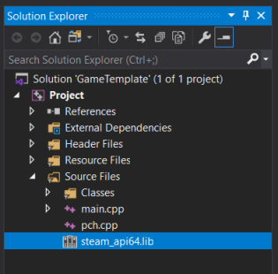

# Steamworks SDK Integration #
The Steamworks SDK provides a range of features which are designed to help ship your application or game on Steam in an efficient manner. This tutorial will explain how to add the Steamworks SDK into your C++ application and initialize the Steam overlay.

## Compiling ##
First, [download the Steamworks SDK](https://partner.steamgames.com/downloads/steamworks_sdk.zip) from Valve.

Extract the contents of the zip file to "(Project Folder)\Source\Steamworks".

Add this line of code anywhere in your "Project.h" file:
```c++
#include "Steamworks/sdk/public/steam/steam_api.h"
```
In Visual Studio, drag the file "Source\\Steamworks\\sdk\\redistributable_bin\\win64\\steam_api64.lib" into the solution explorer.


Copy the file "Source\\Steamworks\\sdk\\redistributable_bin\\win64\\steam_api64.dll" into your project folder.

At this point, your project should be able to compile successfully.

## Usage ##
In "main.cpp", at the start of your program add this line of code:
```c++
SteamAPI_Init()
```
At the end of the main function, add this line of code:
```c++
SteamAPI_Shutdown()
```
Your main.cpp file should now look something like this:
```c++
#include "pch.h"
#include "Project.h"

int main(int argc, const char* argv[])
{
    SteamAPI_Init();

    ...

    //Main loop
    while (window->Closed() == false)
    {
        ...
    }

    SteamAPI_Shutdown();
    return 0;
}
```
To test your game, you need to create a text file in your project folder named "steam_appid.txt" with these contents. This tells the SDK that you application is using an application ID for testing:
```
480
```

When you run your application, the Steam overlay can be shown by pressing Shift + Tab. This is all you need to publish a game or application on Steam. See the [Steamworks documentation](https://partner.steamgames.com/doc/sdk) for additional features you can use.
