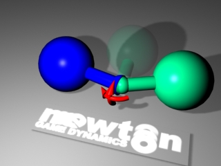

# Physics

Ultra Engine uses [Newton Dynamics](http://newtondynamics.com) to provide fast and stable physics suitable for games and real-time simulations.

## Gravity

## Collision

## Joints

The following joint types are supported:

- Hinge
- Slider

### Ball and socket

This joint type has an anchor (the end of blue sphere) and a moveable body that is "hanging" by this anchor (the beginning of the green sphere). The movement of that body is free to all directions, but limited to a certain degree (specified in angles), so that the child body's movement is limited to a cone-shped area. A good example for such a joint is your wrist angle or your hip joint.

- Plane
- Kinematic

## Character Controller

A special physics mode is supported to handle the movement of characters throughout a scene.

## Vehicles

